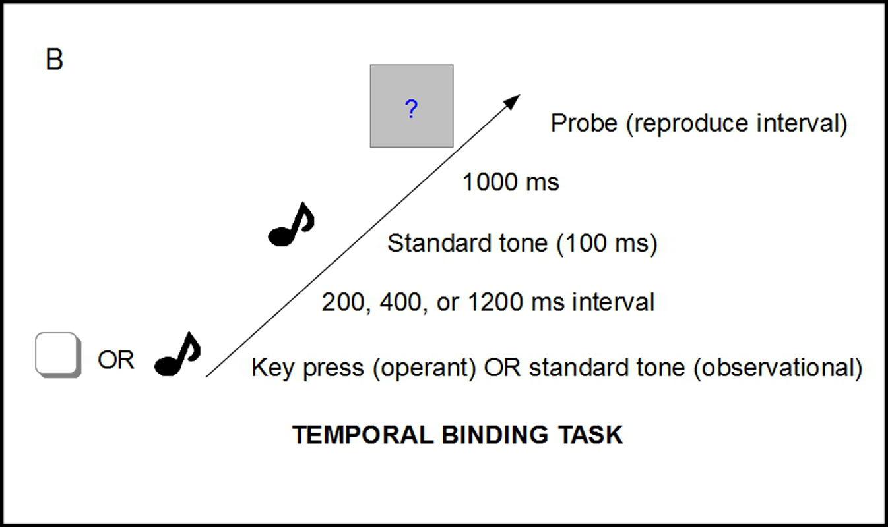

This directory contains data from Dewey & Knoblich (2014), "Do Implicit and Explicit Measures of the Sense of Agency Measure the Same Thing?", published in the journal *PLOS ONE*. 

> ABSTRACT: The sense of agency (SoA) refers to perceived causality of the self, i.e. the feeling of causing something to happen. The SoA has been probed using a variety of explicit and implicit measures. Explicit measures include rating scales and questionnaires. Implicit measures, which include sensory attenuation and temporal binding, use perceptual differences between self- and externally generated stimuli as measures of the SoA. In the present study, we investigated whether the different measures tap into the same self-attribution processes by determining whether individual differences on implicit and explicit measures of SoA are correlated. Participants performed tasks in which they triggered tones via key presses (operant condition) or passively listened to tones triggered by a computer (observational condition). We replicated previously reported effects of sensory attenuation and temporal binding. Surprisingly the two implicit measures of SoA were not significantly correlated with each other, nor did they correlate with the explicit measures of SoA. Our results suggest that some explicit and implicit measures of the SoA may tap into different processes.

## Introduction

Humans typically see themselves -- at least to some extent -- as being in control of events around them. Individual differences in this 'sense of agency', as it is called, are of interest to researchers because it seems intimately related to our sense of self, and because it has been implicated in psychiatric disorders such as schizophrenia. Patients with schizophrenia may experience either a lack of control over their own actions or a sense that they have control over others' actions.

Crucial to understanding individual differences in people's sense of agency is being able to measure that sense. Dewey and Knoblich were interested in different ways that have been used to measure it, and how strongly they are related. In particular, they look at several proposed implicit and explicit measures.

Two implicit measures were explored, based on previous research: a "sensory attenuation" task and a "temporal binding" task. Both tasks exploit observed differences in behaviour when people initiate an action (e.g., with a button press) vs when someone else (e.g., a computer) does. We will focus on the temporal binding task.

In the temporal binding task, a participant's basic task was to reproduce a time interval by holding down the space bar for some amount of time. The time interval they were asked to reproduce was represented by two tones either 200ms, 400ms, or 1200ms apart. Agency was manipulated in blocks by either having the participant initiate the trial through a button press (the 'Operant' condition, which is more 'agentic') or having the computer automatically begin each trial (by showing a fixation cross).

---



---

The dependent measure was the length of the interval reproduced by the participant. The data shared in this pack (obtained from author J. Dewey's [Open Science Framework page](https://osf.io/2pfyz/)) represents the *median* interval length over 30 trials identical trials.

In previous work it has been found that in participant-initiated trials, the interval is judged to be shorter: a so-called 'attraction' between an act and its effects. On page 5, the authors present an mixed-ANOVA analysis of the temporal binding task data, with three independent variables: 

* [within-subjects] `delay`, the length of the interval (200ms, 400ms, 1200ms)
* [within-subjects] `condition`, the agentic condition (operant vs observational) 
* [between-subjects] `order`, whether they did the sensory attenuation task or the temporal binding first in the lab

The relevant data from the temporal binding task are in `data/Dewey_Knoblich_2014_tb_long.sav` and `data/Dewey_Knoblich_2014_tb_wide.sav` (see below for details).

## Files:

Below I describe the critical files in the folder. The files in `raw_data/` were obtained from the J. Dewey's [Open Science Framework page](https://osf.io/2pfyz/).

| Filename                | Type      | Description |
|:------------------------|:------|:------------|
| `readme.md`             | File    | File describing the folder contents |
| `readme.html`           | File    | Compiled HTML version of `readme.md` |
| `Dewey_Knoblich_2014.Rproj` | File | RStudio project file for running the R code |
| `.Rprofile` | File | File to load `renv` for the R analyses (installs the necessary packages) |
| `renv.lock` | File | List of package versions used by `renv` |
| `data`  | Folder | Contains `sav` files for the temporal binding task, generated from the `csv` files.  |
| `documents` | Folder | Contains a PDF copy of Dewey and Knoblich (2014), from which the data are taken, as well as a link to the Open Science Framework page containing the data |
| `media` | Folder | Contains png versions of Figure 1 (p. 4) (to help describe the study) |
| `R` | Folder | Contains R code to compile the raw data and to do basic analyses |
| `raw_data`  | Folder | Contains `csv` files with the data as obtained from the Open Science Framework |
| `renv` | Folder | Contains the necessary working files for `renv` to install necessary packages  |

## Contents of the `data/` folder

The `data/` folder contains two files, `Dewey_Knoblich_2014_tb_long.sav` and `Dewey_Knoblich_2014_tb_wide.sav` both of which contain the data for the temporal binding task described by Dewey and Knoblich. They are redundant; the only difference is that the `wide` data set has been converted to a format convenient for repeated-measures analysis in SPSS. Both files were generated from the `R/99_write_spss_data.R` script.

### Columns in `Dewey_Knoblich_2014_tb_long.sav`

| Column name          | Content | Description    |
|:---------------------|:--------|:---------------|
| `subid`              | Integer code | Unique participant identifier |
| `gender`             | Integer (`1`: female, `2`: male) | Gender of the participant |
| `delay`              | Integer (`1`: 200ms, `2`: 400ms, `3`: 1200ms) | The time interval to be reproduced |
| `condition`          | Integer (`1`: Operant, `2`: Observational) | Whether the participant was in a block where they initiated the time interval ('operant') or the computer initiated it ('observational')  |
| `order`              | Integer (`1`: Sensory attribution task first, `2`: Temporal binding task first) | The task performed first in the lab; this was counterbalanced across participants |
| `estimated_interval` | Numeric | The median interval length reproduced by participants across 30 trials in that delay/condition |

### Columns in `Dewey_Knoblich_2014_tb_wide.sav`

The `subid`, `gender`, and `order` columns are as described above. The remaining columns are described below.

| Column name            | Content | Description    |
|:-----------------------|:--------|:---------------|
| `Operant_200ms`        | Numeric | Participant's median interval length reproduced by participants across 30 200ms, operant trials |
| `Observational_200ms`  | Numeric | Participant's median interval length reproduced by participants across 30 200ms, observational trials |
| `Operant_400ms`        | Numeric | Participant's median interval length reproduced by participants across 30 400ms, operant trials |
| `Observational_400ms`  | Numeric | Participant's median interval length reproduced by participants across 30 400ms, observational trials |
| `Operant_1200ms`       | Numeric | Participant's median interval length reproduced by participants across 30 1200ms, operant trials |
| `Observational_1200ms` | Numeric | Participant's median interval length reproduced by participants across 30 200ms, observational trials |

### Columns in `Dewey_Knoblich_2014_correlations.sav`

The `subid`, `gender`, and `order` columns are as described above. The remaining columns are described below. Each implicit measure (`sa`, `tb_200`, `tb_400`, `tb_1200`) was the difference between the `operant` and `observational` measure in each task/condition (see Dewey and Knoblich, p. 5). These can be used to reproduce Tables 1, 2, and 3.

Note that I (R Morey) cannot replicate the correlations for the two orders (Tables 2 and 3) that involve the implicit temporal binding measures (see r/04_correlation_analysis.R). I contacted the first author J Dewey for comment on 21 Oct 2021, but haven't heard back as of 14 Nov 2021.

|Column    |Content |Description |
|:---------|:-------|:-----------|
|`sa`        | Numeric |Implicit agency measure from sensory attenuation task |
|`tb_200`    | Numeric |Implicit agency measure from temporal binding task, 200ms delay |
|`tb_400`    | Numeric |Implicit agency measure from temporal binding task, 400ms delay |
|`tb_1200`   | Numeric |Implicit agency measure from temporal binding task, 1200ms delay |
|`MI`        | Numeric |Participant's score on Magical Ideation scale (see [here](https://psycnet.apa.org/record/1983-21153-001)) |
|`LoC`       | Numeric |Participant's score on the Locus of Control scale  (see, e.g., [here](https://www.mccc.edu/~jenningh/Courses/documents/Rotter-locusofcontrolhandout.pdf)) |
|`tb_agency` | Numeric |Average response (1-9) to 'How confident do you feel that your key presses produced the tones?' during temporal binding task         |
|`sa_agency` | Numeric |Average response (1-9) to 'How confident do you feel that your key presses produced the first tone?' during sensory attenuation task |


## The `R` folder

The names of the R scripts begin with an integer that represents the order in which they're intended to be run. 

| File or Folder              | Type | Description      |
|:----------------------------|:-----|:-----------------|
| `00_read_data.R`            | File | Reads all `csv` files in the `raw_data` folder, and does some basic tidying |
| `01_sa_analysis.R`          | File | Reproduce the analysis of the sensory attenuation data as described on page 4 of Dewey and Knoblich |
| `02_tb_analysis.R`          | File | Reproduce the analysis of the temporal binding data as described on pages 4-5 of Dewey and Knoblich |
| `03_agency_analysis.R`      | File | Reproduce the analysis of the Likert scale ratings of agency data as described on page 5 of Dewey and Knoblich |
| `04_correlation_analysis.R` | File | Reproduce the analysis of the correlations between all measures as described on pages 5-7 of Dewey and Knoblich |
| `99_write_spss_data.R`      | File | Write the SPSS data found in `data/`, for use in teaching |

If you are using R to run this code, it is recommended you open the project file `Dewey_Knoblich_2014.Rproj` in RStudio. You can then install `renv` and run:

```
renv::restore()
```

which will install all necessary packages listed in `renv.lock` to run the R scripts.


---

* Dewey, J. A., & Knoblich, G. (2014). Do Implicit and Explicit Measures of the Sense of Agency Measure the Same Thing? *PLOS ONE, 9(10), e110118*. https://doi.org/10.1371/journal.pone.0110118
