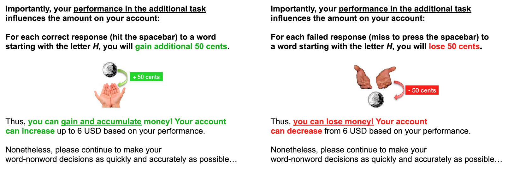

This directory contains data from Horn and Freund (2021), "Adult age differences in remembering gain- and loss-related intentions" published in *Cognition and Emotion*. The materials and data are as obtained from the Open Science Framework project site at https://osf.io/9pwcd/.

> ABSTRACT: Motivational and emotional changes across adulthood have a profound impact on cognition. In this registered report, we conducted an experimental investigation of motivational influence on remembering intentions after a delay (prospective memory; PM) in younger, middle-aged, and older adults, using gain- and loss-framing manipulations. The present study examined for the first time whether motivational framing in a PM task has different effects on younger and older adults’ PM performance (N = 180; age range: 18–85 years) in a controlled laboratory setting. Based on lifespan theories of motivation, we assumed that the prevention of losses becomes more relevant with increasing age: We expected that older adults show relatively higher PM performance in a task with loss-related consequences following PM failure than in a task in which successful PM leads to gains. The opposite pattern of performance was expected for younger adults. The findings suggest that the relevance of reward and positive gain-related consequences for successful remembering appears to decrease with age. As hypothesised, a motivational framing × age interaction indicated that age differences in memory performance were smaller with loss-related than gain-related consequences, supporting a loss-prevention view on motivated cognition.

## Introduction

How well can you remember to do something you must do in the future, particularly when you're not sure when you'll need to remember it? This kind of memory is called *prospective memory*, and it is known to worsen with age. 

Horn and Freund asked participants to indicate whether strings of letters on the screen were actual words or non-words (e.g., 'bunky'). This is called a *lexical decision* task. However, they also had to remember to do something else: they were asked to remember to press the space bar if the word/non-word began with a specific letter. This special event only happened in a small proportion (about 4%) of trials. 

---


---

The proportion of times in the special trials one remembers to press the space bar can be used as a measure of prospective memory.

One thing that interacts with memory is motivation. People naturally do better when they are motivated by, for instance, money. They may even be differently motivated when payment is framed as a "loss" (you start with $X, but we take away money when you make a mistake) vs a "gain" (you start with nothing, but we give you money when you have a success). Although the "losses" and "gains" are equivalent in terms of the money you end up with, some theories of aging posit that older adults are more sensitive to loss framing than gain framing.

Horn and Freund also manipulated the framing of the task, with some participants being told that they will *gain* money when the successfully remember to hit the space bar on special trials ("gain framing") that they will *lose* money for missing the special trial ("loss" framing), or were simply given a flat fee (a "control" framing).

---



---

The main question of interest is how prospective memory performance will change with age in the three motivational conditions. The authors hypothesized that:

> * **Hypothesis 1**: "Regarding PM performance, we expect relative advantage for gain-related over loss-related framing in younger adults and a relative advantage for loss-related over gain-related framing in older adults. We thus hypothesize motivational valence × age interactions."
> * **Hypothesis 2**: "We further hypothesize age-related differences in PM performance: older adults in an event-based laboratory PM tasks are expected to show lower PM performance than younger adults."
> * **Hypothesis 3**: "Notably, this also implies that adult-age differences in PM are smaller for loss- than gain-related intentions."
> * **Hypothesis 4**: "Finally, we expect that PM will be higher in groups with performance-contingent payoffs than in a control group in which payoffs are not tied to performance (H4)."

(Hypotheses were taken from the pre-registration document in `documents/registration/OSF Key Questions.pdf`, p. 2).


## Files:

Below I describe the critical files in the folder. The files in `raw_data/` were obtained from the project's [Open Science Framework page](https://osf.io/9pwcd/).

| Filename                | Type      | Description |
|:------------------------|:------|:------------|
| `readme.md`             | File    | File describing the folder contents |
| `readme.html`           | File    | Compiled HTML version of `readme.md` |
| `Horn_Freund_2021.Rproj` | File | RStudio project file for running the R code |
| `.Rprofile` | File | File to load `renv` for the R analyses (installs the necessary packages) |
| `renv.lock` | File | List of package versions used by `renv` |
| `data`  | Folder | Contains `sav` file for the, generated from the project `csv` files.  |
| `documents` | Folder | Contains a PDF copy of Horn and Freund (2021), from which the data are taken, as well as various supporting materials (see below) |
| `materials` | Folder | Contains the code to run the task, lists of words used in the task, and instructions
| `media` | Folder | Contains a png version of Figure 2 (p. 7) (to help describe the study) |
| `R` | Folder | Contains R code to compile the raw data and to do basic analyses |
| `raw_data`  | Folder | Contains `csv` files with the data as obtained from the Open Science Framework |
| `renv` | Folder | Contains the necessary working files for `renv` to install necessary packages  |

## The `documents` folder

| Filename                | Type      | Description |
|:------------------------|:------|:------------|
| `results/Horn_Freund_2021.pdf` | File  | Copy of Horn and Freund (2021) as published in *Cognition and Emotion* |
| `results/CEM.RegisteredReport.Horn.Freund.2021.pdf` | File    | Copy of Horn and Freund (2021) as a pre-print |
| `results/CEM.SupportingInformation.Horn.Freund.pdf` | File    | Supporting information for Horn and Freund (2021), including description of the basic task, a power analysis, descriptions of the additional questionnaires collected, and some additional regression analyses |
| `registration/RR_MS_HornFreund.pdf` | File | The pre-registration document for the project (written before the data were collected) |
| `registration/OSF Key Questions.pdf` | File | Answers to clarification questions about the pre-registration, including the question of interest, descriptions of the variables, and hypotheses |


## The `data/` folder

The data file `data/Horn_Freund_2021.sav` was generated from the `R/99_write_spss_data.R` script, which uses the compiled data obtained from the [Open Science Framework](https://osf.io/9pwcd/) as found in `raw_data/Analysis files/Manuscript.Analysis.File.csv`.

### Columns in `Horn_Freund_2021.sav`

See `documents/results/CEM.SupportingInformation.Horn.Freund.pdf` for a description of the additional questionnaires asked of the participants. These descriptions are derived from the codebook in `raw_data/Analysis Files/Codebook.Variables.for.Manuscript.Analysis.File.pdf`, obtained from S. Horn on 4 Dec 2021.

| Column name          | Content | Description    |
|:-----|:--------|:----------------------------|
| `Age` | Integer | Chronological age in years at time of study participation |
| `Age.Group` | String | Age variable categorized: "Younger" (<36), "Middle" (36-65), "Older adults" (>65) |
| `Sex` | String | Self-reported sex (Male=1; Female=2; Other=3) |
| `Condition` | String | Framing of the reward, the between-subjects manipulation: "Control", "Gain", or "Loss" |
| `Accuracy.PM.Task` | Numeric (min: 0, max 1) | Proportion of 'hits' in the prospective memory (on target trials, how often they remembered what to do) |
| `Accuracy.OngoingTask` | Numeric (min: 0, max 1) | Accuracy in the secondary lexical decision task (on all trials, how often they correctly categorized the word/non-word) |
| `RT.Mdn.OngoingTask` | Numeric (min: 0) | Median response time in the secondary lexical decision task (in ms) |
| `RT.Mdn.PM.Task` | Numeric (min: 0) | Median response time on prospective-memory targets (in ms) |
| `Monetary.Motivation` | Numeric (min: 0, max: 100) | Rating of monetary motivation  |
| `PayoffRetained` | Numeric (min: 0, max: 100) | Percentage of payoff participants kept for themselves in incentivized (non-control) conditions |
| `Importance.OngoingTask` | Numeric | Self-rating of perceived importance of ongoing task |
| `Importance.PMTask` | Numeric | Self-rating of perceived importance of prospective-memory task |
| `N.Nontargets` | Integer (min: 0) | Number of individual non-target, secondary lexical-decision trials from each participant |
| `N.Targets` | Integer (min: 0) | Number of individual prospective-memory task target trials from each participant |
| `LossAversion` | Numeric (min: 0, max: 6) | Score from brief test/questionnaire of loss aversion |
| `Education` | Numeric (min: 1, max 6; other: 7) | Ordinal education level rating |
| `Income` | Numeric (min: 1, max: 8) | Ordinal income level rating |
| `LifeSatisfaction` | Numeric (min: 1, max: 7) | Self-rating of subjective life satisfaction |
| `Health` | Numeric (min: 1, max: 7) | Self-rating of subjective health |
| `CognitiveSpeed` | Numeric | Score on cognitive speed test (digit-symbol substitution test) |
| `Vocabulary` | Numeric | Score on vocabulary test |
| `SocialValueOrientation` | Numeric | Score on social value orientation questionnaire |
| `GainOrientation` | Numeric (min: 1, max: 8) | Rating of motivational gain orientation |
| `MaintenanceOrientation` | Numeric (min: 1, max: 8) | Rating of motivational maintenance orientation|
| `LossOrientation` | Numeric (min: 1, max: 8) | Rating of motivational loss-avoidance orientation |
| `PositiveAffect` | Numeric | Score of positive affect in the Positive and Negative Affect Schedule (PANAS; see [here](https://doi.apa.org/doi/10.1037/0022-3514.54.6.1063)) questionnaire |
| `Negative.Affect` | Numeric | Score of negative affect in the PANAS questionnaire |
| `PRMQ.Prospective` | Numeric | Score for the prospective memory scale of the Prospective and Retrospective Memory Questionnaire (PRMQ; see [here](https://www.ed.ac.uk/ppls/psychology/research/facilities/philosophy-and-psychology-library/psychological-tests/prmq) |
| `PRMQ.Retrospective` | Numeric | Score for the retrospective memory scale of the PRMQ |


## The `R` folder

The names of the R scripts begin with an integer that represents the order in which they're intended to be run. 

| File or Folder              | Type | Description      |
|:----------------------------|:-----|:-----------------|
| `00_read_data.R`            | File | Reads all `csv` files in the `raw_data` folder, and does some basic tidying (incomplete) |
| `99_write_spss_data.R`      | File | Write the SPSS data found in `data/`, for use in teaching |

If you are using R to run this code, it is recommended you open the project file `Horn_Freund_2021.Rproj` in RStudio. You can then install `renv` and run:

```
renv::restore()
```

which will install all necessary packages listed in `renv.lock` to run the R scripts.


---

* Horn, S. S., & Freund, A. M. (2021). Adult age differences in remembering gain- and loss-related intentions. Cognition and Emotion, 35(8), 1652–1669. https://doi.org/10.1080/02699931.2021.1986375
