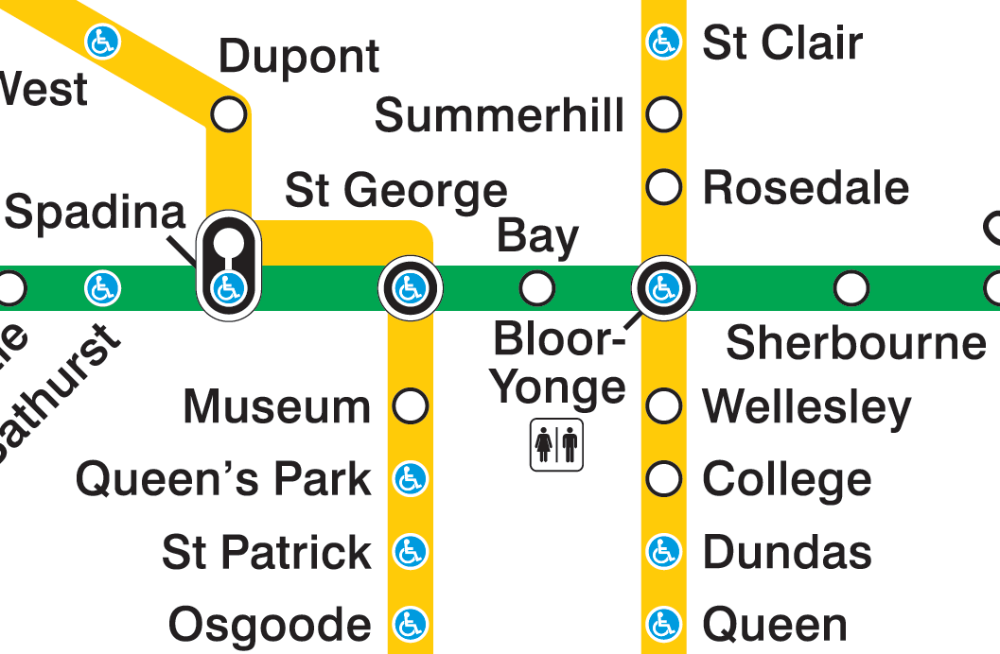

This directory contains data from Maglio & Polman (2014), "Spatial Orientation Shrinks and Expands Psychological Distance", Study 1, published in the journal *Psychological Science*. 

> ABSTRACT: Being objectively close to or far from a place changes how people perceive the location of that place in a subjective, psychological sense. In the six studies reported here, we investigated whether people's spatial orientation (defined as moving toward or away from a place) will produce similar effects—by specifically influencing psychological closeness in each of its forms (i.e., spatial, temporal, probabilistic, and social distance). Orientation influenced subjective spatial distance at various levels of objective distance (Study 1), regardless of the direction people were facing (Study 2). In addition, when spatially oriented toward, rather than away from, a particular place, participants felt that events there had occurred more recently (Studies 3a and 3b) and that events there would be more likely to occur (Study 4). Finally, participants felt more similarity to people who were spatially oriented toward them than to people who were spatially oriented away from them (Study 5). Our investigation broadens the study of psychological distance from static spatial locations to dynamically moving points in space.

When we think about what it means for something to be *far away* or *close*, we couple an objective concept of distance (say, 1000 meters) with a more subjective feeling about that distance. Two people may agree about the former (e.g., "the restaurant is 2km away"), but disagree about the latter (e.g., "That is so far"; "Are you kidding? It's just around the corner!").  

Maglio and Polman were interested in what affects that psychological, subjective sense of distance in the context of traveling within a large city (Toronto, in this case). In particular, they were interested in how one's *orientation* (traveling toward or away from somewhere) might affect one's sense of distance.

Below you can see a section of the Bloor-Danforth line (green, horizontal) centered on Bay station. On this line routes travel west, through St. George and Spadina stations, and east, through Bloor-Yonge and Sherbourne stations.

---



---

Maglio and Polman asked 202 travelers at Bay station how far away they "felt" one of the four stations was (Spadina, St. George, Bloor-Yonge, or Sherbourne; randomly selected for each participant). The objective walking distance from Bay station to each of the four stations is 1100m west, 760m, west, 410m east, and 1100m east, respectively. They asked people on both the east (travelers headed toward Sherbourne) and west (travelers headed toward Spadina) sides of the platform.

(They survey can be found in `documents/materials/`; other materials from the study can be obtained from Maglio and Polman's [Open Science Framework page](https://osf.io/7rajd/))

They found that people seemed to rate distances in the direction they are travelling as shorter, suggesting (to the authors) a sort of "compression" of subjective distances ahead of us (as opposed to behind).


## Files:

Below I describe the critical files in the folder.

| Filename                | Type      | Description |
|:------------------------|:------|:------------|
| `readme.md`             | File    | File describing the folder contents |
| `readme.html`           | File    | Compiled HTML version of `readme.md` |
| `Maglio_Polman_2014.Rproj` | File | RStudio project file for running the R code |
| `.Rprofile` | File | File to load `renv` for the R analyses (installs the necessary packages) |
| `renv.lock` | File | List of package versions used by `renv` |
| `data`  | Folder | Contains a `csv` file with the data |
| `documents` | Folder | Contains a PDF copy of Maglio and Polman (2014), from which the data are taken, as well as a link to the Open Science Framework page containing the data and materials |
| `documents/materials` | Folder | Contains Word documents with the four surveys used in the experiment |
| `media` | Folder | Contains PDF and PNG maps of the Toronto subway system (to help describe the study) |
| `R` | Folder | Contains R code to compile the raw data and to do a basic analysis |
| `renv` | Folder | Contains the necessary working files for `renv` to install necessary packages  |


## Contents of `data/Maglio_Polman_2014.csv`

Each row in the file `Maglio_Polman_2014.csv` represents the response of a single participant in the study.

The following table describes the columns in the data file:

| Column name   | Content | Description    |
|:--------------|:--------|:---------------|
| `DIRECTION`   | String ('EAST' or 'WEST') | Which platform direction the participant was at, in Bay station |
| `DISTANCE`    | Integer (min: 1 [very close], max: 7 [very far]) | Response of the participant to the question 'How far away does the [station name] station feel to you?' |
| `STN_NUMBER`  | Integer code (min: 1, max: 4) | Station number from west to east (1: Spadina, 2: St. George, 3: Bloor-Yonge, or 4: Sherbourne) |
| `STN_NAME`    | String | Short station name (`SPAD`: Spadina, `STG`: St. George, `B-Y`: Bloor-Younge, or `SHER`: Sherbourne) 


## The `R` folder

| File or Folder    | Type | Description      |
|:------------------|:-----|:-----------------|
| `analysis.R`      | File | Script to perform all analyses. |

If you are using R to run this code, it is recommended you open the project file `Maglio_Polman_2014.Rproj` in RStudio. You can then install `renv` and run:

```
renv::restore()
```

which will install all necessary packages listed in `renv.lock` to run the R scripts.


---

Maglio, S. J., & Polman, E. (2014). Spatial orientation shrinks and expands psychological distance. Psychological Science, 25(7), 1345–1352. https://doi.org/10.1177%2F0956797614530571

Toronto Transit Commission. (2018). TTC Subway Map. https://www.ttc.ca/PDF/Maps/Subway_Map.pdf

