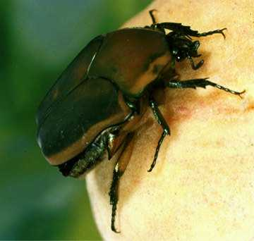

## Description

This folder contains the data Ryan, Wilde, and Crist (2013), "Compared to a small, supervised lab experiment, a large, unsupervised web-based experiment on a previously unknown effect has benefits that outweigh its potential costs". It also contains a copy of the published paper.

> **ABSTRACT**: Research on internet-based studies has generally supported their benefits. However, that research sometimes did not directly compare internet-based to traditional delivery, often used non-experimental methods and small samples, and has not used an entirely unknown effect for the comparison to completely rule out demand characteristics. Our lab experiment (N = 180), in which participants were supervised by an experimenter, demonstrated previously unexamined effects. Both the frighteningness and disgustingness of insects made people want to kill them, and females wanted to kill the insects more than males did. There were also some interesting patterns of interaction with gender, but they were not statistically significant. However, an unsupervised, but larger, web-based experiment (N = 1301) produced the same significant main effects as the lab study, and the same patterns of interaction that had occurred at a non-significant level in the lab study occurred at a statistically significant level in the web-based study. These results add support to the finding that although web-based studies may incur risks by being unsupervised, such as some participants not being genuinely motivated to follow the instructions correctly, the risks are compensated for by the much larger sample size afforded by the web-based approach.

In two experiments, Ryan et al. showed participants pictures of "bugs" (arthropods of various sorts: insects, spiders, scorpions, etc) and asked to what extent (on a 0-10 scale) participants "either wanted to kill, or at least in some way get rid of, that particular insect". A response of 0 meant "not want to kill the insect at all"; 10 meant "greatest possible desire to kill the insect". The bugs had been rated on two scales prior to the experiment by a separate set of participants: "disgustingness" and "frighteningness". The bugs were then categorised by the researchers as low- or high-disgustingness and low- or high-frighteningness. Two examples for each of the resulting 2x2=4 categories are shown in Ryan et al. Figure 1 (p. 1297).



The two experiments differed in their methods: Experiment 1 was a controlled lab experiment, typical of research with undergraduates across Psychology departments; the second was an a less-well-controlled online study. The research question was whether these two experiment types differed in their results. Experiment 2 was run from 2005 to 2006.

This data pack contains the data, materials, and code from Experiment 2.

## Files:

Materials, code, and data were obtained from author B. Ryan (cogprofessor@gmail.com) in September of 2021.

| File or folder      | Type    | Description |
|:--------------------|:--------|:------------|
| `readme.md`         | File    | Description of the project |
| `readme.html`       | File    | An HTML compiled version of `readme.md` |
| `documents/Ryan_etal_2013.pdf` | File    | A copy of Ryan, Wilde, & Crist (2013) as published in  the journal *Computers in Human Behavior*.| 
| `data/Ryan_eta_2013_Study2_wide.sav`  | File    | The data for Study 2 of Ryan et al. (2013), in wide format. See below for a description.  |
| `data/Ryan_eta_2013_Study2_long.sav`  | File    | The data for Study 2 of Ryan et al. (2013), in long format. |
| `materials/`     | Folder | Contains stimuli, code, and information about the experimental method. See below. |
| `R`  | Folder    | Contains R analysis scripts |
| `renv` | Folder  | |
| `Ryan_etal_bugs.Rproj` | File | The Rstudio project file for the R analysis   |
| `renv.lock` | File  | File containing a list of all the packages needed for the analysis (to be used by `renv`) |
| `.Rprofile`         | File    | Script file loaded when R starts (loads `renv`) |


## `data/Ryan_eta_2013_Study2_wide.sav` 

The hostility scale referred to in the last eight columbs is a self-rated feeling of hostility against the bug: from 0, 'not want to kill the insect at all' to 10, 'greatest possible desire to kill the insect.' See Ryan et al, p. 1297.

The full data set contained 1351 participants. My initial attempt to clean the data as described by Ryan et al yielded 1283 participants (which is different from the reported 1301 participants, p. 1298). I tried various ways of cleaning but could not get the exact number.

|Column                |Content    |Description                   |
|:---------------------|:----------|:------------------------------|
| `sub`             | Integer    | Participant id        |
| `gender`              | Integer (1: male, 2: female)    | Answer to 'Your gender?' |
| `age` | Numeric (years) | Answer to 'How old are you?' |
| `region`              | Integer (1: N. America, 2: Europe, 3: Other, 4: Australia, 5: S. America, 6: Asia, 7: Africa) | Answer to 'Where are you from?' |
| `education` | Integer (1: 'less than high school', 2: 'high school graduate', 3: 'some college', 4: 'college graduate', 5: 'partial advanced degree training', 6: 'advanced degree') | Answer to 'What is your level of education?' |
| `english` | Integer (1: non-native, 2: native) | Answer to 'Is English your native language?' |
| `why_part` | Integer (1: 'As an assignment for school', 2: 'Looing for something to do', 3: 'Just for fun', 4: 'Other', 5: 'Interested in psychology') | Answer to 'Why are you participating in this experiment?' |
| `how_find` | Integer (1: 'Heard about it from someone', 2: 'Just browsing the web', 3: 'Read about it on another website', 4: 'Was looking for a psychology experiment') | Answer to 'How did you find out about this experiment?' |
| `before` | Integer (1: 'Never', 2: 'One before this one', 3: 'Several before this one', 4: 'Many before this one') | Answer to 'Have you done psychology experiments on the web before?' |
| `internet` | Integer (1: 'Seldom', 2: 'Occasionally', 3: 'Fairly often', 4: 'Every day') | Answer to 'How much do you use the internet?' |
| `expect`   | Integer (1: 'no', 2: 'yes', 3: 'we'll see') | Answer to 'Do you think you will enjoy this experiment?' |
| `order`    | Integer (1-16) | Which one of 16 possible orderings of the eight stimuli was shown |
| `lolo1`         | Integer (0-10) | For the picture of the assassin bug (low frighteningness, low disgustingness), a rating on a 'hostility' scale |
| `lolo2`         | Integer (0-10) | For the picture of the june beetle (low frighteningness, low disgustingness), a rating on a 'hostility' scale |
| `lohi1`         | Integer (0-10) | For the picture of the diving beetle (low frighteningness, high disgustingness), a rating on a 'hostility' scale |
| `lohi2`         | Integer (0-10) | For the picture of the cockroach (low frighteningness, high disgustingness), a rating on a 'hostility' scale |
| `hilo1`         | Integer (0-10) | For the picture of the cicada killer (high frighteningness, low disgustingness), a rating on a 'hostility' scale |
| `hilo2`         | Integer (0-10) | For the picture of the wasp (high frighteningness, low disgustingness), a rating on a 'hostility' scale |
| `hihi1`         | Integer (0-10) | For the picture of the scorpion (high frighteningness, high disgustingness), a rating on a 'hostility' scale |
| `hihi2`         | Integer (0-10) | For the picture of the ant lion (high frighteningness, high disgustingness), a rating on a 'hostility' scale |

## `data/Ryan_eta_2013_Study2_long.sav`

The contents of `data/Ryan_eta_2013_Study2_long.sav` were derived from `data/Ryan_eta_2013_Study2_wide.sav` using the code in `R/01_analysis.R`. The new columns `condition`, `frig`, `disg`, `stimnum`, and `hostility` were formed from the last eight columns of the wide-format data set described above.

## `materials/` folder

| File or folder      | Type    | Description |
|:--------------------|:--------|:------------|
| `antlion.jpg` | File | Picture of an ant lion, used as stimulus |
| `Assassin bug.jpg` | File | Picture of an assassin bug, used as stimulus |
| `cicada_killer1.jpg` | File | Picture of a cicada killer, used as stimulus |
| `cockroach2.JPG` | File | Picture of a cockroach, used as stimulus |
| `divingBeetle.jpg` | File | Picture of a diving beetle, used as stimulus |
| `June Beetle.jpg` | File | Picture of a june beetle, used as stimulus |
| `scorpion2.jpg` | File | Picture of a scorpion, used as stimulus |
| `wasp_1.jpg` | File | Picture of a wasp, used as stimulus |
| `orderings/order_data_columns.csv` | File | CSV file that describes, for each order, what order the stimuli described in the columns of the wide data set were presented in (e.g., if `lolo1` contains `4`, then the assassin bug was presented fourth) |
| `orderings/order_stimuli.csv` | File | CSV file that describes, for each order, what order the stimuli were presented in. Columns 2-9 give the first, second, ..., eighth stimlus presented. |
| `code/` | Folder | Contains the original stimulus presentation code as perl scripts, as obtained from B. Ryan |


## `R` folder

| File or folder      | Type    | Description |
|:--------------------|:--------|:------------|
| `01_analysis.R`        | File    | R analysis script to for a basic analysis of the Ryan et al. data |
| `98_write_neat_data.R` | File    | R script used to create `data/Ryan_eta_2013_Study2_wide.sav` from the data set obtained from B. Ryan |
| `99_stimulus_order.R`  | File    | R script used to output the files in `materials/orderings/` from the original experimental code. These files describe the presentation order of the stimuli |

If you are using R to run this code, it is recommended you open the project file `Ryan_etal_bugs.Rproj` in RStudio. You can then install `renv` and run:

```
renv::restore()
```

which will install all necessary packages listed in `renv.lock` to run the R scripts.


## Citations

Ryan, R. S., Wilde, M., & Crist, S. (2013). Compared to a small, supervised lab experiment, a large, unsupervised web-based experiment on a previously unknown effect has benefits that outweigh its potential costs. Computers in Human Behavior, 29(4), 1295–1301. https://doi.org/10.1016/j.chb.2013.01.024
