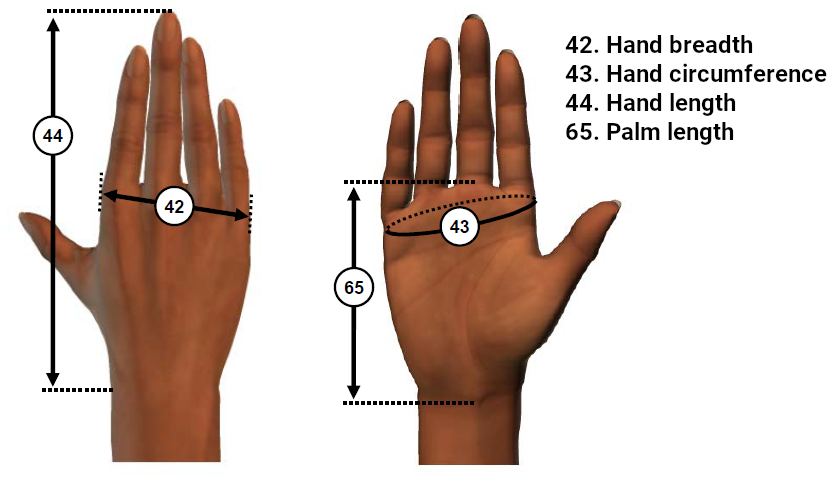

This directory contains data from the ANSUR II anthropometric (body measurement) survey of US Army service members.

> EXECUTIVE SUMMARY: A comprehensive anthropometric survey of the U.S. Army was completed by the Natick Soldier Research, Development and Engineering Center (NSRDEC) in 2012. The goals of the survey were to acquire a large body of data from comparably measured males and females to serve the Army’s current design and engineering needs, as well as those anticipated well into the future. Ninety-three directly measured dimensions and 41 derived dimensions, as well as three-dimensional head, foot, and whole-body scans, were obtained in this study. The sample here, which represents the Total Army, was composed of 4,082 men and 1,986 women, measured between October 4, 2010 and April 5, 2012. Results of the traditionally measured and derived dimensions were compiled in the form of summary statistics, percentile data, and frequency distributions. Demographic data characterizing the sample were collected in terms of the racial/ethnic, gender, age, geographic, and occupational distribution of the participants, and a detailed explanation of how observer error was calculated for the study to ensure optimum reliability.
>
> The impetus for this survey was the concern that Army body size and shape had changed since the last anthropometric survey in 1987-1988 (ANSUR). A pilot study conducted in 2006 confirmed that significant changes had taken place. Army body size for a number of dimensions had increased, on average, and the variability had increased as well. Further, ANSUR included only Active Duty personnel, whereas today’s forces are integrated as part of the Total Army concept. To the extent that the current anthropometry is different from ANSUR, equipment and workspaces may no longer be optimal.

## Introduction


These data were obtained from the [Penn State Open Design lab](https://www.openlab.psu.edu/ansur2/) who have helpfully placed several anthropometric data sets online for public use. They have also created nice data exploration apps for browsing and comparison of various data sources (both military and civilian).

The ANSUR II data set here contains measurements on 1,986 women and 4,082 men (totaling 6,086 people).

---



---


## Files:


| Filename                | Type      | Description |
|:------------------------|:------|:------------|
| `readme.md`             | File    | File describing the folder contents |
| `readme.html`           | File    | Compiled HTML version of `readme.md` |
| `ansur_2.Rproj` | File | RStudio project file for running the R code |
| `.Rprofile` | File | File to load `renv` for the R analyses (installs the necessary packages) |
| `renv.lock` | File | List of package versions used by `renv` |
| `data`  | Folder | Contains a `sav` file with all data generated from the `csv` files in `raw_data/` |
| `documents` | Folder | Contains PDF copies of the technical documents for the ANSUR survey |
| `media` | Folder | Edited images(s) from the report Appendices, to help describe the survey |
| `R` | Folder | Contains R code to compile the raw data and to do basic analyses |
| `raw_data`  | Folder | Contains `csv` files with the data as obtained from the the [Open Design Lab](https://www.openlab.psu.edu/ansur2/) |
| `renv` | Folder | Contains the necessary working files for `renv` to install necessary packages  |

I made one edit to `raw_data/ANSUR_II_MALE_Public.csv` from the version I obtained from the [Open Design Lab](https://www.openlab.psu.edu/ansur2/). I changed the name of the `subjectid` column to `SubjectId` in order to be consistent with `raw_data/ANSUR_II_FEMALE_Public.csv`. The files are otherwise the way I obtained them in September 2021.

## Contents of the `documents/` folder

| Filename                | Type      | Description |
|:------------------------|:------|:------------|
| `ANSURII-MFR.pdf`       | File    | Brief summary of the ANSUR II documents |  
| `ANSURII-TR11-017.pdf`  | File    | ANSUR II measurer's handbook containing instructions for measurers | 
| `ANSURII-TR15-007.pdf`  | File    | ANSUR II report containing description of methods and summary statistics |


## Contents of the `data/` folder

### Columns in `ansur2.sav`

There are 108 columns in the data set; this is too many to list here, so I'll give a summary by column group. 

For descriptions of columns 2-94, see pages 45-230 in the ANSUR II report. Measured dimensions are presented in order in the report. For columns 95-108, the survey on page 437 of the ANSUR II report (Appendix H) shows how the data were collected.

| Column number(s) | Column name          | Content | Description    |
|:---------|:---------------------|:--------|:---------------|
| 1  | `SubjectId`           | Integer code | Unique participant identifier |
| 2-94 |  | Numeric | Lengths in mm (2-91,93-94) or weights in kg (92) |
| 95  | `Gender` | String | Self-reported gender of servicemember |
| 96  | `Date`  | String | Date the measurements were taken  |
| 97  | `Installation`  | String | Where the measurements were taken  |
| 98-100  | | String  | Information about the servicemember's wing and role in the US Army |
| 101 | `SubjectsBirthLocation`  | String  | Self-reported  |
| 102-104 |   | String | Self-reported information about servicemember's race and ethnicity  |
| 105 | `Age`  | Numeric  | Self-reported age |
| 106 | `Heightin`  | Numeric | Self-reported height in inches |
| 107 | `Weightlbs`  | Numeric | Self-reported weight in pounds |
| 108 | `Writing preference`  | String | Self-reported preference of writing hand (Right hand, Left hand, or Either hand) |


## The `R` folder

The names of the R scripts begin with an integer that represents the order in which they're intended to be run. 

| File or Folder              | Type | Description      |
|:----------------------------|:-----|:-----------------|
| `01_read_data.R`      | File | Read in data from `cvs` files in `raw_data/` |
| `99_write_spss_data.R`      | File | Write the SPSS data found in `data/`, for use in teaching |

If you are using R to run this code, it is recommended you open the project file `ansur_2.Rproj` in RStudio. You can then install `renv` and run:

```
renv::restore()
```

which will install all necessary packages listed in `renv.lock` to run the R scripts.


---

* Gordon, C.C., Blackwell, C.L., Bradtmiller, B., Parham, J.L., Barrientos, P., Paquette, S.P., Corner, B.D., Carson, J.M., Venezia, J.C., Rockwell, B.M., Mucher, M., and Kristensen, S., 2015, "2012 Anthropometric Survey of U.S. Army Personnel: Methods and Summary Statistics." Report No. NATICK/TR-15/007. https://dacowits.defense.gov/LinkClick.aspx?fileticket=EbsKcm6A10U%3D&portalid=48
